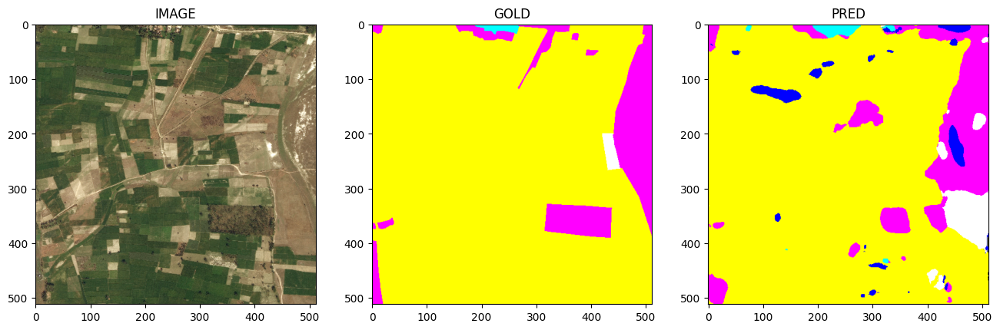
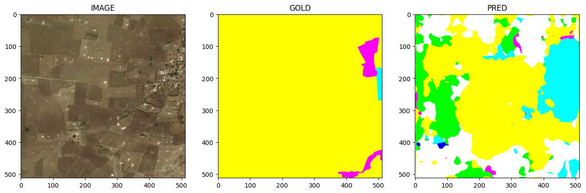

# Land-Cover-Classification with UNet++ and DeepLabV3

This repository contains implementations for **land cover classification** using **UNet++** and **DeepLabV3**, leveraging advanced techniques such as **ensemble learning** and **transfer learning** to improve segmentation accuracy. The models are trained and evaluated on high-resolution remote sensing imagery to classify different land cover types.

## Dataset

The dataset used for training and evaluation is the [DeepGlobe Land Cover Classification Dataset](https://www.kaggle.com/datasets/balraj98/deepglobe-land-cover-classification-dataset) available on Kaggle. This dataset includes satellite images from different regions, with labeled data for various land cover types.

## Models & Techniques

- **UNet++**: A modified version of UNet with dense skip pathways to improve the capture of fine-grained spatial features.
- **DeepLabV3**: A deep convolutional model for semantic image segmentation using atrous convolution and spatial pyramid pooling.
- **Transfer Learning**: Models use pretrained weights from ImageNet to enhance generalization.
- **Ensemble Learning**: Combining predictions from multiple models to improve performance and robustness.

## Test Results

### 1. **DeepLabV3 with ResNet101 Backbone (Pretrained Weights)**

- **Test Metrics:**
    - Accuracy: 94.85%
    - F1-Score: 81.98%
    - IoU: 71.32%
    - Loss: 0.374
    - Precision: 81.98%
    - Recall: 81.98%

    
    

### 2. **UNet++ with ResNet101 Backbone (Pretrained Weights)**

- **Test Metrics:**
    - Accuracy: 93.99%
    - F1-Score: 78.99%
    - IoU: 67.78%
    - Loss: 0.448
    - Precision: 78.99%
    - Recall: 78.99%

    
    

### 3. **UNet++ with ResNet101 Backbone (Transfer Learning)**

- **Test Metrics:**
    - Accuracy: 94.74%
    - F1-Score: 81.60%
    - IoU: 70.41%
    - Loss: 0.410
    - Precision: 81.60%
    - Recall: 81.60%

    
    

### 4. **DeepLabV3 with ResNet101 Backbone (Transfer Learning)**

- **Test Metrics:**
    - Accuracy: 93.91%
    - F1-Score: 78.68%
    - IoU: 67.97%
    - Loss: 0.436
    - Precision: 78.68%
    - Recall: 78.68%

    
    

### 5. **Ensemble Model (UNet++ + DeepLabV3)**

The ensemble model combines predictions from both **UNet++** and **DeepLabV3** to improve segmentation accuracy and robustness.

### Results
The repository contains results of various model architectures along with their evaluation metrics. DeepLabV3 with ResNet101 and transfer learning achieved the best overall performance in terms of IoU. However, UNet++ with transfer learning also performed well, providing a competitive alternative for land cover classification tasks.
